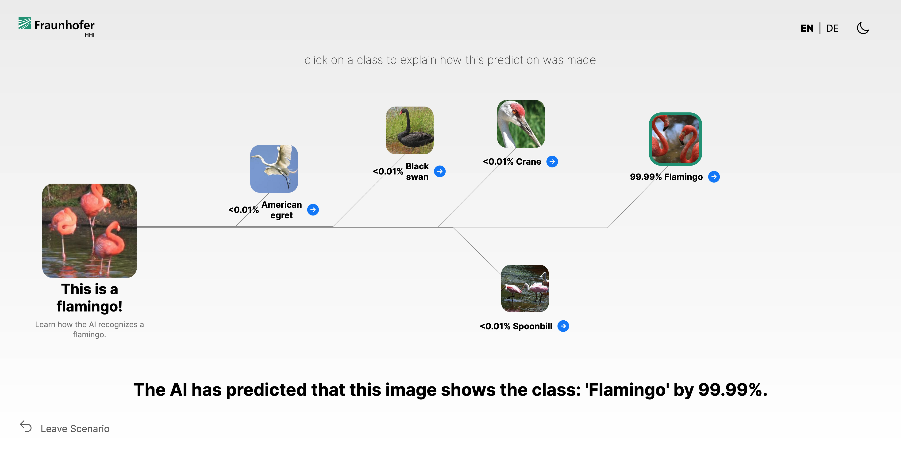
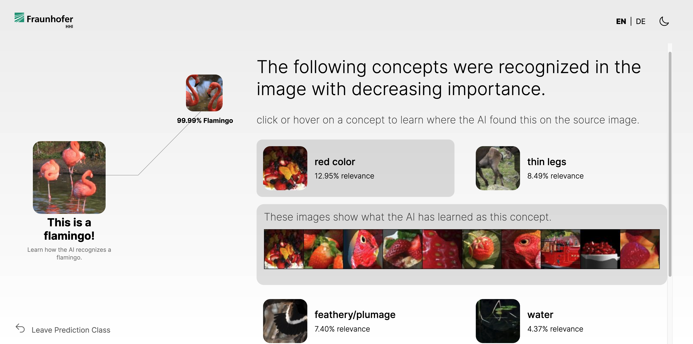
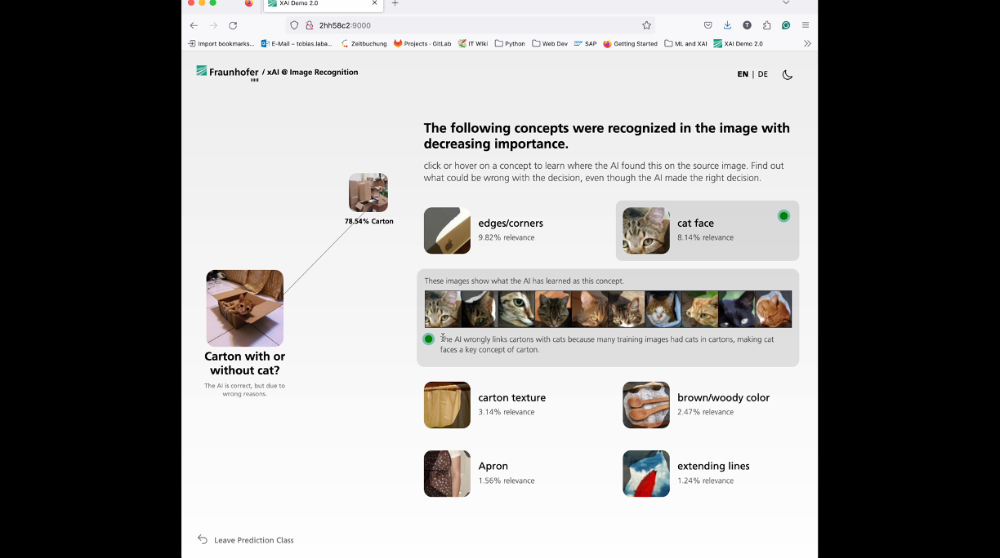
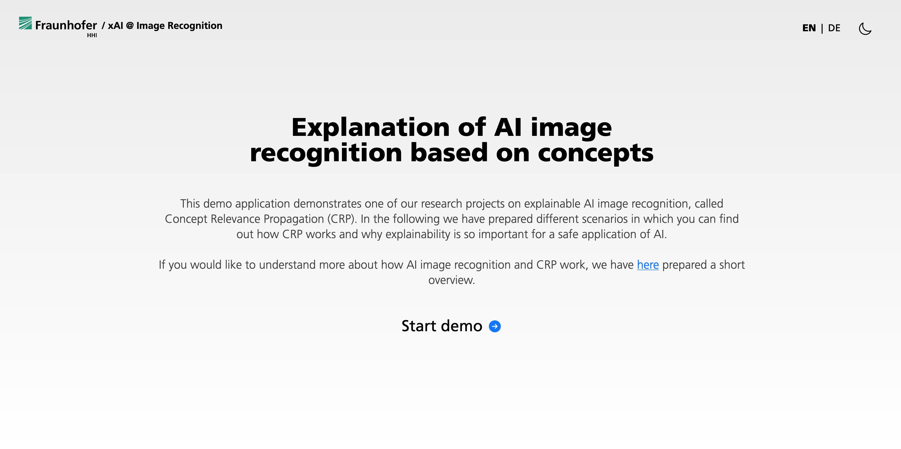
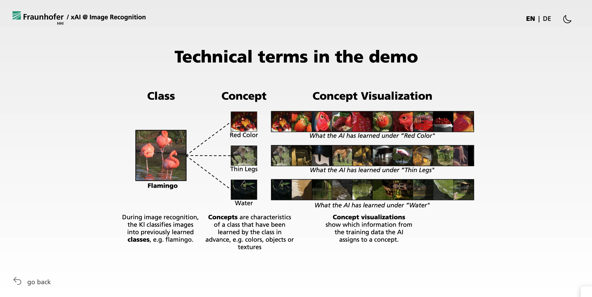

# XAI Demo 2.0

Welcome to the XAI Demo 2.0! This project aims to present the latest breaking research of our group with a modern look, fit and understandable for the specific target group. 

## Release 1: CRP Demo for Girls Day 25.04.2024

In the first release, we wanted to develop a demo for the <i>Girls Day @ HHI</i> with the focus on image recognition. The demo aims to give more insights into how image recognitions works and how we can make it explainable by using concepts. We implemented the work from <i>Achtibat, R. et al. "From attribution maps to human-understandable explanations through concept relevance propagation".</i> We defined 4 scenarios to show potential use cases of XAI:
1. <b>This is a flamingo!</b> - Learn how the AI recognizes a flamingo.
2. <b>Is this a llama or ibex?</b> - The model made a mistake. Find out why.
3. <b>Carton with or without cat?</b> - The AI is correct, but due to wrong reasons.
4. <b>This is a dangerous!</b> - Problematic behavior of an AI for skin cancer detection.

## Release 2: Guided mode

In this release, we have enhanced our Image Recognition Demo with a new feature called <b>Guided Mode</b>. This update aims to make the demo more self-explanatory, enabling it to be presented without requiring team members to explain it.

<b>Key Features of This Upgrade:</b>

1. <b>Scenario Explanation:</b> To ensure that every user can follow and understand the storyline of each scenario, we have added explanations for concepts that are relevant to the model's decisions. These explanations are accompanied by interactive UI elements to engage users in discovering them.
2. <b>Welcome Screen:</b> A newly designed landing page with a brief introduction to the demo (see Screenshot 1). This screen offers users the option to jump to a more detailed explanation of technical terms.
3. <b>Detailed Explanation:</b> An in-depth explanation of key terms important for the demo, such as "class," "concept," and "concept visualization."
4. <b>Timeout:</b> The demo will now reset to the landing page after 5 minutes of inactivity, ensuring a fresh start for new users.

click to view scenario explanation

click to view welcome screen

click to view detailed explanation

